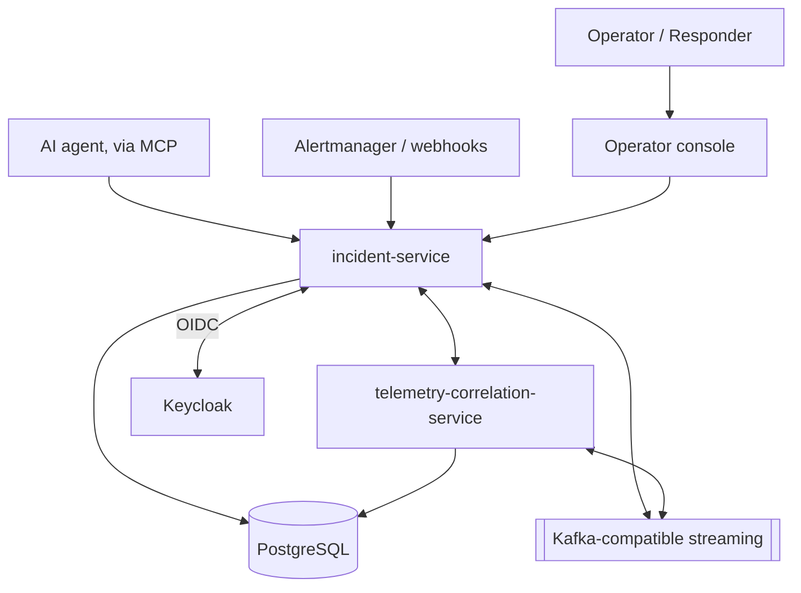

# SentinelOps

An incident-detection, investigation, and remediation platform: ingests alerts and telemetry,
deduplicates and correlates them into incidents, offers AI-assisted triage with cited evidence,
exposes a policy-gated Model Context Protocol (MCP) interface for AI agents, and executes
approved remediation runbooks with automatic rollback on failure — all with an immutable audit
trail and full observability.

Built and authored by **Aarav Shah** as a single-developer portfolio project, in sixteen
incremental phases, each building on tested, working functionality from the last.

## Problem and motivation

Real incident response is fragmented: alerts arrive from multiple sources with no deduplication,
correlation is manual, triage relies on tribal knowledge, and remediation is either fully manual
(slow) or fully automated (risky, with no approval gate or rollback). SentinelOps is a
from-scratch exploration of what a smaller, coherent version of that pipeline looks like when
every stage — ingestion, correlation, triage, proposal, approval, execution, rollback, audit — is
built deliberately, tested, and deployable, rather than assumed away.

## Major capabilities

| Capability | Where |
| --- | --- |
| Multi-source alert ingestion, deduplication, correlation, routing | `docs/development/alert-ingestion.md` |
| Telemetry correlation (deployment/dependency-change events) | `docs/architecture/system-overview.md` |
| Role-based auth (Keycloak OIDC), audit logging | `docs/development/security.md` |
| AI-assisted triage with cited, retrieval-grounded evidence and graceful fallback | `docs/development/ai-triage.md` |
| Operator console (React) | `frontend/README.md` |
| Secure MCP server: read-only tools, propose-then-approve for every mutation | `docs/development/mcp-server.md` |
| Policy-controlled remediation: versioned runbooks, deny-by-default policy engine, two-person approval, automatic rollback | `docs/development/remediation.md` |
| Chaos-engineering framework (11 experiments), SLO/error-budget engine, disaster-recovery exercises | `docs/validation/` |
| Kubernetes/Helm, Terraform (AWS), GitOps-ready CI/CD | `infrastructure/helm/`, `infrastructure/terraform/`, this document's "Deployment options" |

## Architecture



Full diagram set (system context, alert-to-incident sequence, AI-triage/RAG flow, MCP
proposal/approval flow, remediation state machine, observability pipeline, deployment topology):
**`docs/architecture/diagrams.md`**. Data model: **`docs/architecture/data-model.md`**. Threat
model: **`docs/architecture/threat-model.md`**.

## Technology stack

- **Backend**: Java 21, Spring Boot 3.4 (`incident-service`, `telemetry-correlation-service`)
- **Frontend**: React + TypeScript, Vite, Vitest, Playwright
- **Data**: PostgreSQL (+ pgvector), Redis, Redpanda (Kafka-API-compatible), MinIO (S3-compatible)
- **Auth**: Keycloak (OIDC, RBAC)
- **Observability**: OpenTelemetry, Prometheus, Grafana, Loki, Tempo, Alertmanager
- **AI**: retrieval-augmented triage against a deterministic or local-Ollama provider — no paid
  API required (see "AI without external credentials" below)
- **Agent interface**: Model Context Protocol (official Java SDK)
- **Deployment**: Kubernetes + Helm, Terraform (AWS), Argo CD (GitOps)
- **CI/CD**: GitHub Actions — SpotBugs, Trivy, CodeQL, gitleaks, OWASP ZAP, SBOM generation,
  cosign image signing, SLSA provenance

Every tool above is free/open-source; no paid cloud resource has ever been provisioned for this
project (see `infrastructure/terraform/README.md`).

## Local quick start

```bash
git clone https://github.com/ashah5123/SentinelOps.git && cd SentinelOps
cp .env.example .env   # replace every "change-me-local-dev-only" placeholder
make infra-up          # core platform: Postgres, Redis, Redpanda, MinIO, Keycloak
make incident-up       # incident-service (app profile)
make correlation-up    # telemetry-correlation-service
```

See `docs/development/local-platform.md` for prerequisites, port configuration, health
verification, and troubleshooting.

## Demo

```bash
make demo           # start the full platform + walk through the complete workflow
make demo-cleanup   # stop everything and remove volumes
```

Deterministic seed data — no external production system required. Five-minute technical
walkthrough script: `docs/development/demo.md`.

## Screenshots

**None are included.** This repository's own verification discipline (see "Benchmark
methodology" below) does not permit publishing a screenshot that wasn't actually captured from a
running instance, and no live browser session was available in the environment this phase was
authored in to capture one. Run `make demo` and `cd frontend && npm run dev` to see the console
live — `docs/development/demo.md` describes exactly what you'll see at each step.

## Security model

Keycloak OIDC bearer tokens on every authenticated endpoint; role-based access control
(VIEWER/RESPONDER/ADMIN) enforced per-endpoint; HMAC-signed generic webhooks with replay
protection; self-approval and approval-replay rejected server-side for both agent proposals and
remediation executions; deny-by-default remediation policy engine; immutable audit trail. Full
detail: `docs/development/security.md`, `docs/architecture/threat-model.md`. CI security
tooling: `docs/validation/security-validation.md`.

## Observability model

Every service exports Prometheus metrics, OpenTelemetry traces (correlated across the alert →
incident → proposal → remediation chain), and structured logs shipped to Loki. Seven SLOs with
error-budget/burn-rate tracking are computed by `incident-service` itself and surfaced in the
console's Platform Health page. See `docs/architecture/diagrams.md`'s observability-pipeline
diagram and `docs/validation/slo.md`.

## Testing strategy

Unit and integration tests (JUnit/Mockito, Testcontainers for Docker-dependent cases), a
deterministic AI-evaluation harness (retrieval recall/precision, structured-output validity,
prompt-injection resistance), Playwright end-to-end scenarios, an 11-experiment chaos framework
with enforced safety guarantees, k6 load-testing scenarios with declared regression thresholds,
and a disaster-recovery exercise measuring real RTO/RPO. See `docs/validation/README.md` for the
single command that runs the reproducible subset of this suite locally.

## Deployment options

| | Where |
| --- | --- |
| Local (Docker Compose) | `docs/development/local-platform.md` |
| Kubernetes + Helm (any cluster) | `infrastructure/helm/sentinelops/` |
| AWS (Terraform, dev/production examples) | `infrastructure/terraform/` |
| GitOps (Argo CD) | `docs/development/production-deployment.md` |

## Benchmark methodology and verified results

**Every published number is traceable to a reproducible command and an actual result — nothing
here is estimated or rounded up.** See `docs/portfolio-evidence.md` for the full evidence
(environment, exact commands, actual measured results, explicitly labeled limitations) built
from `docs/validation/latest-results.md`, the record of the last successful local validation
run. No production load, deduplication-rate, or availability claim is made because none has been
measured against a live deployment — see that document's "Limitations affecting interpretation"
section.

## AI without external credentials

The platform runs completely without any LLM API key or network access: set
`sentinelops.ai.provider=deterministic` (the CI/test default) for a rule-based, citation-honest
provider, or `sentinelops.ai.provider=ollama` to use a local model with no data leaving the
machine. If AI is disabled or fails entirely, incident creation, correlation, and remediation are
unaffected — triage is additive, never load-bearing (verified by
`ChaosInjectingAiProviderTest`). See `docs/development/ai-triage.md`.

## Known limitations

- No live load test, chaos experiment, or disaster-recovery drill has been executed against a
  real deployment in the environment that authored this code (no Docker/cluster available there)
  — CI runs all of these live on every push; see `docs/validation/` for exactly what each check
  covers and what remains environment-dependent.
- Terraform modules were written and reviewed but never `apply`'d against a real AWS account.
- No screenshots exist yet (see "Screenshots" above).
- Redis and MinIO are provisioned in every environment but not yet read/written by any
  application code path (see `docs/development/local-platform.md`) — infrastructure ahead of the
  feature that will use it, documented rather than hidden.
- Single-tenant only; no per-tenant resource-scope isolation exists or is tested.

## Future improvements

- Wire a Redis-backed cache into a real read path and measure its effect.
- Add object-storage-backed postmortem/artifact generation using the already-provisioned MinIO
  buckets.
- Expose remediation-runbook proposals as an MCP tool (currently MCP proposes incident-level
  actions only — see `docs/development/mcp-server.md`'s known limitations).
- Run a real load-test baseline against a staging deployment and replace this README's
  "no production numbers exist" caveat with actual measured capacity.

## Repository structure

```
services/incident-service/              Spring Boot application (REST API, MCP server, remediation engine)
services/telemetry-correlation-service/ Spring Boot application (deployment/dependency correlation)
frontend/                               React operator console
infrastructure/docker/                  Local Compose stack, k6 scenarios, chaos/DR/demo scripts
infrastructure/helm/sentinelops/        Kubernetes Helm chart
infrastructure/terraform/               AWS infrastructure modules + dev/production examples
docs/                                   Architecture, API/event contracts, ADRs, operations, validation
.github/workflows/                      CI (push/PR) and release (tag-triggered) pipelines
```

## License and contributions

MIT License — see `LICENSE`. This is a single-author portfolio project; see `CONTRIBUTING.md`
for the (currently minimal) contribution process. Security issues: see `SECURITY.md`.

## Author

Aarav Shah
