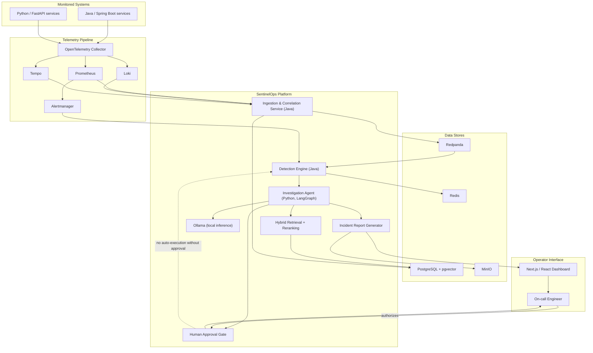

# SentinelOps

**Cloud-native incident detection and investigation platform.**

Status: **Foundation** — repository scaffolding, architecture, and
development standards only. No application services are implemented yet.

## Overview

SentinelOps is designed to help teams running distributed Java and
Python services detect reliability incidents faster, understand *why*
they happened, and act on them safely. It correlates metrics, traces,
and logs; detects SLO violations; ties incidents back to recent
deployments and service dependencies; and produces evidence-backed
root-cause analysis with recommended remediation — while requiring
explicit human authorization before any operational action is taken.

## Problem being solved

Modern distributed systems generate enormous volumes of telemetry, but
turning that telemetry into a trustworthy, actionable incident
narrative is still largely manual. On-call engineers spend the first,
most critical minutes of an incident correlating dashboards, logs, and
recent deployments by hand. SentinelOps aims to automate that
correlation and investigation work — without automating away human
judgment on remediation.

## Planned capabilities

- Continuous monitoring of distributed Java and Python services.
- Correlated collection of metrics, traces, and logs (OpenTelemetry).
- Automated detection of reliability incidents and SLO violations.
- Correlation of incidents with recent deployments and known service
  dependencies.
- Retrieval of relevant operational runbooks via hybrid search.
- Generation of evidence-backed root-cause analysis.
- Remediation recommendations, gated behind explicit human approval.
- Post-remediation recovery verification and auditable incident
  reporting.

None of the above is implemented yet; this repository currently
contains only foundation-phase scaffolding.

## Planned technology stack

| Layer | Technology |
|---|---|
| Backend services | Java 21, Spring Boot; Python, FastAPI |
| Frontend | Next.js, React, TypeScript |
| Streaming | Redpanda (Kafka-compatible API) |
| Storage | PostgreSQL + pgvector, Redis, MinIO |
| Orchestration | Docker Compose (local), Kubernetes via `kind`, Helm |
| Infrastructure as code | Terraform |
| Delivery | Argo CD, GitHub Actions |
| Observability | OpenTelemetry, Prometheus, Grafana, Loki, Tempo, Alertmanager |
| Identity | Keycloak (OAuth 2.0, OIDC, JWT, RBAC) |
| AI / agents | LangGraph, Ollama (local inference), hybrid retrieval and reranking |
| Testing & security | JUnit, pytest, Testcontainers, Playwright, Pact, k6, Trivy, CodeQL, controlled failure testing |

## High-level architecture

## Security principles

- **Human-approved remediation**: no operational or remediation action
  is ever executed automatically. Every recommendation requires
  explicit human authorization before anything touches a real system.
- **Least privilege and standard identity protocols**: authentication
  and authorization go through Keycloak using OAuth 2.0, OIDC, and JWT,
  with role-based access control.
- **No secrets in source control**: local configuration is derived from
  `.env.example`; real credentials are never committed.
- **Defense-in-depth for the software supply chain**: dependency and
  container scanning (Trivy) and static analysis (CodeQL) are part of
  the intended CI pipeline.
- **Auditable by design**: every incident investigation produces a
  reviewable, evidence-backed report.

## Local-first, zero-cost development

All default development and demonstration workflows run entirely on
your local machine using Docker Compose or a local `kind` Kubernetes
cluster — no paid cloud resources or paid API keys are required. Local
LLM inference is provided by Ollama. AWS is documented as an optional
deployment target for later phases, but no AWS resources are
provisioned by this project by default.

## Development roadmap

See [`docs/roadmap.md`](docs/roadmap.md) for the full, phased roadmap
with acceptance criteria. In summary:

1. **Foundation** (current) — repository, architecture, standards.
2. Local infrastructure baseline (Compose stack for data stores,
   observability, identity).
3. Telemetry ingestion and correlation service.
4. Detection engine and SLO evaluation.
5. Investigation agent, retrieval, and root-cause analysis.
6. Human-approval workflow and remediation recommendations.
7. Operator dashboard and auditable reporting.
8. Kubernetes/Helm packaging and optional AWS deployment mapping.

## Architecture documentation

- [System overview](docs/architecture/system-overview.md)
- [Architecture Decision Records](docs/decisions/)

## Project status

**Foundation.** This repository currently contains only repository
scaffolding, documentation, and development standards. No services,
integrations, tests, or deployments described above are implemented
yet.

## Author

Aarav Shah
