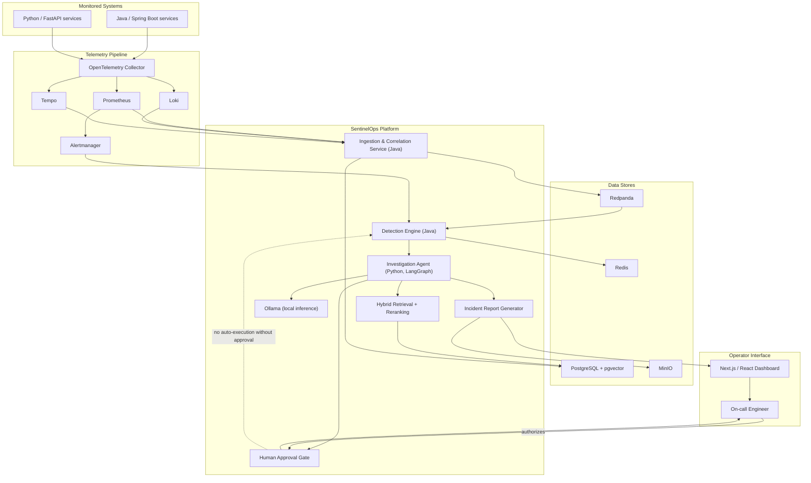

# SentinelOps

**Cloud-native incident detection and investigation platform.**

Status: **Foundation** — repository scaffolding, architecture, a
local data/event-streaming platform (Phase 2), an incident-management
control-plane service (Phase 3), a local observability baseline
(Phase 4: OpenTelemetry Collector, Prometheus, Grafana, Loki, Tempo,
Alertmanager), and a telemetry ingestion and deterministic correlation
service (Phase 5). No authentication, Kubernetes, SLO/anomaly
detection, AI/investigation functionality, frontend, or remediation
execution are implemented yet. See
[docs/roadmap.md](docs/roadmap.md) for current phase status, including
outstanding runtime-verification items.

## Overview

SentinelOps is designed to help teams running distributed Java and
Python services detect reliability incidents faster, understand *why*
they happened, and act on them safely. It correlates metrics, traces,
and logs; detects SLO violations; ties incidents back to recent
deployments and service dependencies; and produces evidence-backed
root-cause analysis with recommended remediation — while requiring
explicit human authorization before any operational action is taken.

## Problem being solved

Modern distributed systems generate enormous volumes of telemetry, but
turning that telemetry into a trustworthy, actionable incident
narrative is still largely manual. On-call engineers spend the first,
most critical minutes of an incident correlating dashboards, logs, and
recent deployments by hand. SentinelOps aims to automate that
correlation and investigation work — without automating away human
judgment on remediation.

## Planned capabilities

- Continuous monitoring of distributed Java and Python services.
- Correlated collection of metrics, traces, and logs (OpenTelemetry).
- Automated detection of reliability incidents and SLO violations.
- Correlation of incidents with recent deployments and known service
  dependencies.
- Retrieval of relevant operational runbooks via hybrid search.
- Generation of evidence-backed root-cause analysis.
- Remediation recommendations, gated behind explicit human approval.
- Post-remediation recovery verification and auditable incident
  reporting.

None of the above is implemented yet; this repository currently
contains only foundation-phase scaffolding.

## Planned technology stack

| Layer | Technology |
|---|---|
| Backend services | Java 21, Spring Boot; Python, FastAPI |
| Frontend | Next.js, React, TypeScript |
| Streaming | Redpanda (Kafka-compatible API) |
| Storage | PostgreSQL + pgvector, Redis, MinIO |
| Orchestration | Docker Compose (local), Kubernetes via `kind`, Helm |
| Infrastructure as code | Terraform |
| Delivery | Argo CD, GitHub Actions |
| Observability | OpenTelemetry, Prometheus, Grafana, Loki, Tempo, Alertmanager |
| Identity | Keycloak (OAuth 2.0, OIDC, JWT, RBAC) |
| AI / agents | LangGraph, Ollama (local inference), hybrid retrieval and reranking |
| Testing & security | JUnit, pytest, Testcontainers, Playwright, Pact, k6, Trivy, CodeQL, controlled failure testing |

## High-level architecture



## Security principles

- **Human-approved remediation**: no operational or remediation action
  is ever executed automatically. Every recommendation requires
  explicit human authorization before anything touches a real system.
- **Least privilege and standard identity protocols**: authentication
  and authorization go through Keycloak using OAuth 2.0, OIDC, and JWT,
  with role-based access control.
- **No secrets in source control**: local configuration is derived from
  `.env.example`; real credentials are never committed.
- **Defense-in-depth for the software supply chain**: dependency and
  container scanning (Trivy) and static analysis (CodeQL) are part of
  the intended CI pipeline.
- **Auditable by design**: every incident investigation produces a
  reviewable, evidence-backed report.

## Local-first, zero-cost development

All default development and demonstration workflows run entirely on
your local machine using Docker Compose or a local `kind` Kubernetes
cluster — no paid cloud resources or paid API keys are required. Local
LLM inference is provided by Ollama. AWS is documented as an optional
deployment target for later phases, but no AWS resources are
provisioned by this project by default.

## Development roadmap

See [`docs/roadmap.md`](docs/roadmap.md) for the full, phased roadmap
with acceptance criteria. In summary:

1. Foundation — repository, architecture, standards. *(complete)*
2. Local data and event-streaming infrastructure — Compose stack for
   PostgreSQL/pgvector, Redis, Redpanda, and MinIO. *(complete)*
3. **Incident-management service** (current) — Java/Spring Boot
   control-plane API, transactional outbox, idempotent anomaly
   consumption.
4. Detection engine and SLO evaluation.
5. Investigation agent, retrieval, and root-cause analysis.
6. Human-approval workflow and remediation recommendations.
7. Operator dashboard and auditable reporting.
8. Kubernetes/Helm packaging and optional AWS deployment mapping.

## Architecture documentation

- [System overview](docs/architecture/system-overview.md)
- [Architecture Decision Records](docs/decisions/)
- [Local platform reference](docs/development/local-platform.md)
- [Incident-service README](services/incident-service/README.md)
- [Incident-service API reference](docs/api/incident-service.md)
- [Event contracts](docs/events/event-envelope.md)

## Local platform (Phase 2)

Phase 2 adds a free, local data and event-streaming platform, running
entirely through Docker Compose: PostgreSQL with pgvector, Redis,
Redpanda (Kafka-compatible), an optional Redpanda Console, and MinIO.
**This runs entirely on your machine — no AWS or other cloud charges
are ever incurred by anything in this repository.**

### Prerequisites

- Docker Desktop (or an equivalent Docker Engine + Compose v2 install)
- `bash` (present by default on macOS)

Run `make doctor` to check these and the rest of the project's
prerequisites without installing or modifying anything.

### Local environment setup

```bash
cp .env.example .env
# edit .env and replace every "change-me-local-dev-only" placeholder
```

`.env` is git-ignored and must never be committed.

### Starting and stopping the platform

```bash
make infra-config   # validate the Compose configuration
make infra-up       # start core services, wait for healthy, init topics/buckets
make infra-status   # show service status/health
make infra-smoke    # run the full smoke test
make infra-down     # stop containers, keep persistent volumes
```

### Service endpoints (all bound to `127.0.0.1` only)

| Service | Default local endpoint |
|---|---|
| PostgreSQL | `127.0.0.1:5432` |
| Redis | `127.0.0.1:6379` |
| Redpanda (Kafka API) | `127.0.0.1:19092` |
| Redpanda Admin API | `127.0.0.1:9644` |
| Redpanda Console (optional) | http://127.0.0.1:8080 |
| MinIO API | http://127.0.0.1:9000 |
| MinIO Console | http://127.0.0.1:9001 |

Ports are configurable via `.env` — see
[`docs/development/local-platform.md`](docs/development/local-platform.md).

### Health verification

`make infra-up` waits for every core service's Docker health check to
pass before returning. `make infra-smoke` additionally verifies
pgvector, required schemas/topics/buckets, authentication, and that no
service is exposed beyond localhost. See
[`docs/development/local-platform.md`](docs/development/local-platform.md)
for what each check does.

### Troubleshooting

See the "Common macOS issues" section of
[`docs/development/local-platform.md`](docs/development/local-platform.md)
for Docker availability, port conflicts, and Apple Silicon notes.

### ⚠️ Data-reset warning

`make infra-clean` **permanently deletes** all local platform data
(PostgreSQL, Redis, Redpanda, and MinIO volumes) after an interactive
`yes` confirmation. `make infra-down` does **not** delete data — use it
for routine stop/start cycles.

## Incident service (Phase 3)

Phase 3 adds `services/incident-service`, a Java 21 / Spring Boot
control-plane API for creating and managing incidents, backed by
PostgreSQL (via Flyway migrations) and a transactional outbox that
publishes versioned events to Redpanda. **It implements no
authentication yet — see the security notice in its own README before
running it anywhere but locally.**

```bash
make incident-build   # compile, format-check, test, package
make incident-image   # build the Docker image
make incident-up      # start infra + the incident service
make incident-logs
make incident-down
```

Full details, API reference, event contracts, and known limitations:
[`services/incident-service/README.md`](services/incident-service/README.md).

## Observability stack (Phase 4)

Phase 4 adds a local OpenTelemetry Collector, Prometheus, Grafana,
Loki, Tempo, and Alertmanager, wired into the incident service's
metrics, distributed traces, and structured logs. It runs as its own
opt-in Compose profile, independent of `app`:

```bash
make observability-up      # start otel-collector, prometheus, loki, tempo, alertmanager, grafana
make observability-status
make observability-smoke   # end-to-end check: metrics/logs/traces flow and alert rules load
make observability-down    # stop, keeping all persistent volumes
```

Grafana (http://127.0.0.1:3001) ships with two provisioned dashboards
("SentinelOps Service Overview" and "SentinelOps Incident Processing")
and datasources wired for trace-to-log correlation. Full endpoint
list, data-flow diagram, and how to trace a single request across
Grafana/Tempo/Loki: [`docs/development/observability.md`](docs/development/observability.md).
Architecture rationale: [ADR 0009](docs/decisions/0009-local-observability-stack-topology.md).

## Telemetry correlation service (Phase 5)

Phase 5 adds `services/telemetry-correlation-service`, a Java 21 / Spring Boot service that
incrementally ingests Prometheus/Loki/Tempo telemetry, consumes deployment and
service-dependency events, and deterministically (rule-based, no AI/ML) correlates evidence
against detected incidents — publishing the result back to the incident service through a
transactional outbox. **It implements no authentication yet — see the security notice in its
own README before running it anywhere but locally.**

```bash
make correlation-build   # compile, format-check, test, package
make correlation-image   # build the Docker image
make correlation-up      # start infra + the telemetry-correlation service
make correlation-logs
make correlation-down
make correlation-smoke   # end-to-end ingestion/correlation smoke test
```

Full details, API reference, event contracts, correlation rules, and known limitations:
[`services/telemetry-correlation-service/README.md`](services/telemetry-correlation-service/README.md).
Architecture rationale: [ADR 0010](docs/decisions/0010-incremental-ingestion-and-correlation.md).

## Project status

**Foundation.** Repository scaffolding, architecture documentation, a
local data/event-streaming platform (Phase 2), an incident-management
service (Phase 3), a local observability baseline (Phase 4), and a
telemetry ingestion/correlation service (Phase 5) exist.
No authentication, Kubernetes, SLO/anomaly detection, AI/investigation
functionality, frontend, or remediation execution described above are
implemented yet.

## Author

Aarav Shah
