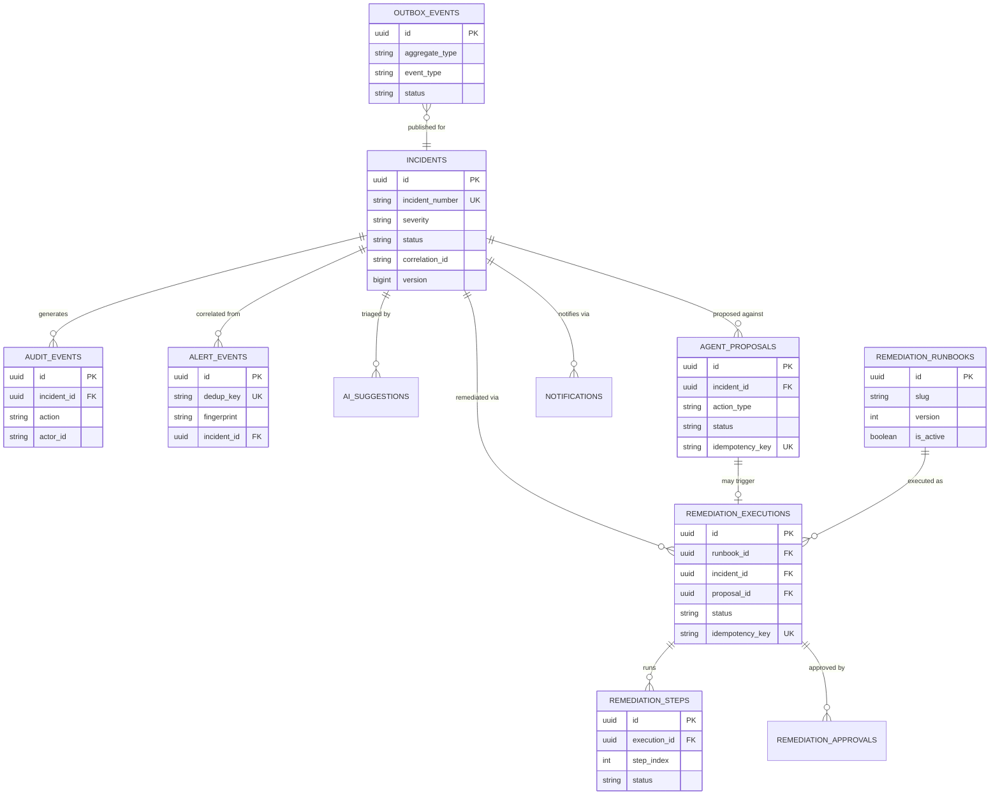

# Data model

High-level entity relationships across the four PostgreSQL schemas (`incidents`, `audit`,
`telemetry`, `runbooks`) this platform uses. For exact column definitions, see the Flyway
migrations under `services/*/src/main/resources/db/migration/` — this document is the map, not
the source of truth.

## Schema ownership

| Schema | Owning service | Contents |
| --- | --- | --- |
| `incidents` | incident-service | Incidents, alerts, notifications, AI suggestions, agent proposals, remediation runbooks/executions/steps/approvals, the transactional outbox, simulated deployment/queue/cache/flag state |
| `audit` | incident-service | Immutable audit events |
| `telemetry` | telemetry-correlation-service | Deployment events, dependency-change events, correlation results |
| `runbooks` | incident-service | pgvector-backed runbook document chunks and embeddings (AI-triage retrieval) — distinct from `remediation_runbooks` in the `incidents` schema, which are executable YAML runbooks, not retrieval documents |

## Key invariants

- Every idempotency-sensitive table (`alert_events.dedup_key`, `agent_proposals.idempotency_key`,
  `remediation_executions.idempotency_key`) enforces a `UNIQUE` constraint — durable, retry-safe
  idempotency at the database level, never only in application logic.
- `incidents.version` is an optimistic-locking column checked on every command
  (`IncidentCommandService`) and re-verified by both the agent-approval and remediation-approval
  flows before executing an action against potentially stale state.
- `audit_events` has no `UPDATE`/`DELETE` path anywhere in the application — append-only by
  construction, not merely by convention (see `docs/operations/data-retention-and-audit-policy.md`).
