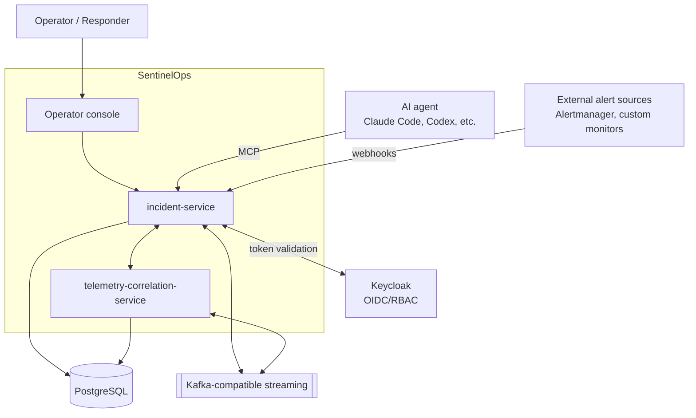
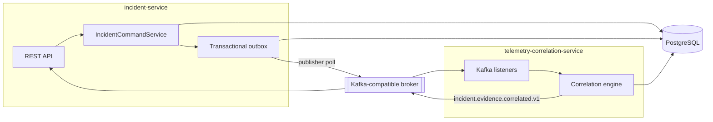
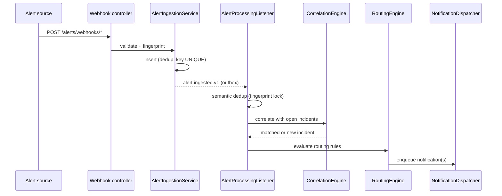
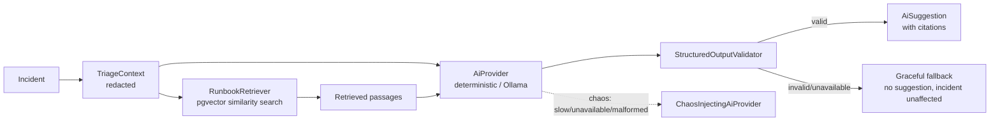
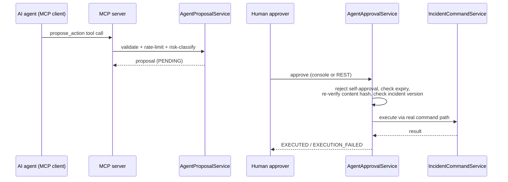
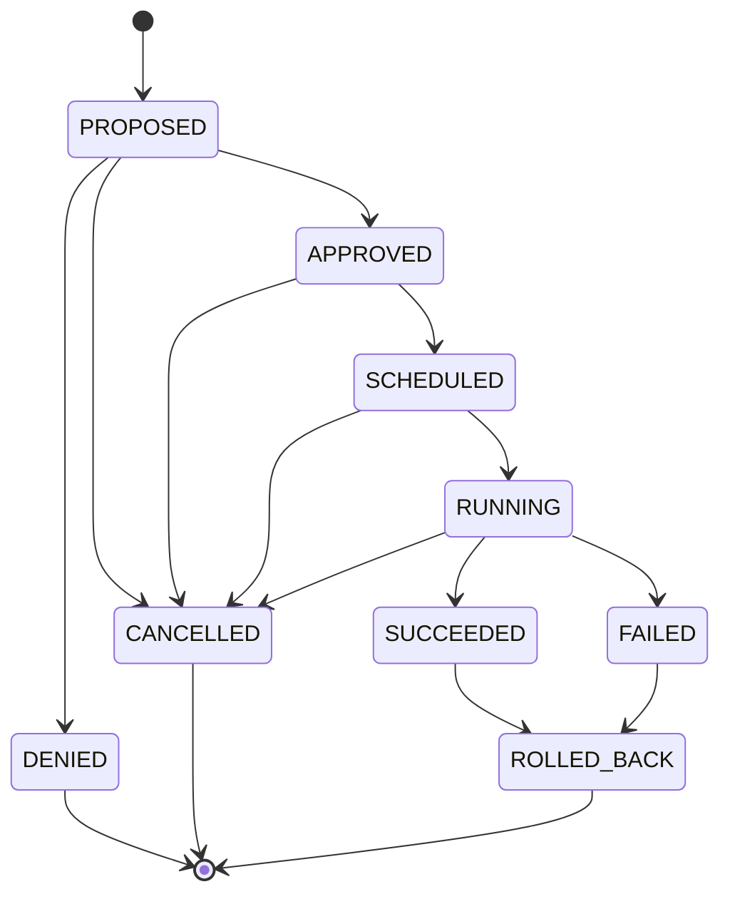
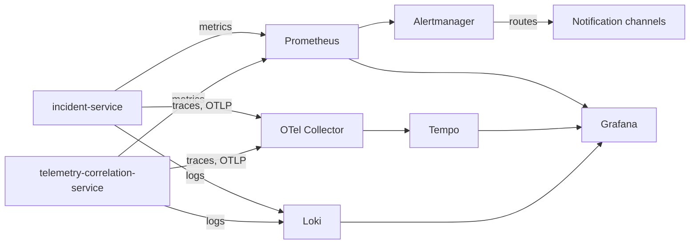
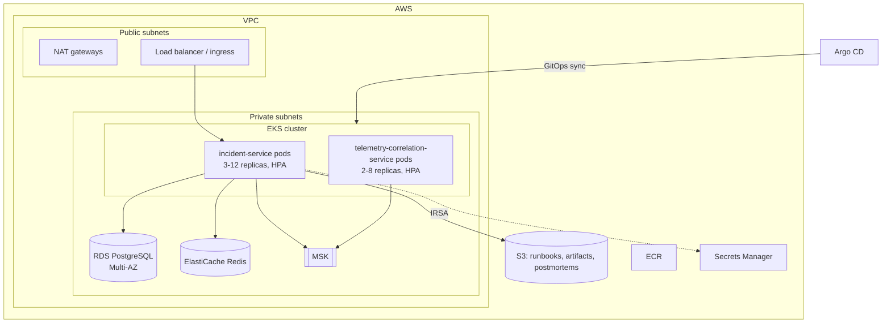

# Architecture diagrams

Every diagram here is Mermaid (source-controlled, renders directly on GitHub, updatable in the
same commit as the code it describes). See `docs/architecture/system-overview.md` for prose
architecture detail this page doesn't repeat.

## 1. System context

## 2. Service and data-flow architecture

## 3. Alert-to-incident processing

## 4. AI-triage and RAG flow

## 5. MCP proposal and approval flow

## 6. Remediation state machine

## 7. Observability pipeline

## 8. Deployment topology (production)

