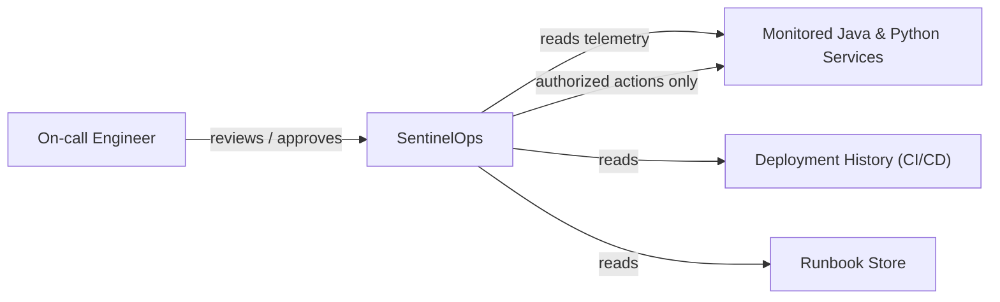
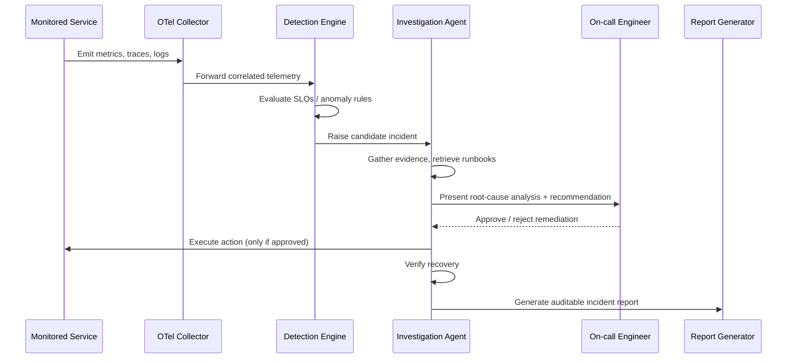

# SentinelOps System Overview

Status: Foundation-phase design document. Describes the intended
architecture; nothing described here is implemented yet unless
explicitly noted.

## 1. System context

SentinelOps sits alongside the systems it observes. It does not
replace an organization's existing services; it consumes their
telemetry and, in later phases, proposes and — only with explicit
human approval — helps execute remediation.

Actors:
- **On-call engineer / operator**: consumes incident reports,
  authorizes or rejects proposed remediation.
- **Monitored services**: Java (Spring Boot) and Python (FastAPI)
  services instrumented with OpenTelemetry.
- **Deployment history**: CI/CD metadata (e.g. GitHub Actions, Argo CD)
  used to correlate incidents with recent changes.
- **Runbook store**: existing operational documentation retrieved
  during investigation.

## 2. Component responsibilities

| Component | Responsibility |
|---|---|
| **OpenTelemetry Collector (implemented — Phase 4)** | Receives OTLP traces/logs from the incident service and forwards traces to Tempo and logs to Loki; also exposes received metrics as a Prometheus scrape target. Local-only — see `docs/development/observability.md`. |
| **Prometheus / Loki / Tempo / Alertmanager (implemented — Phase 4)** | Store and alert on metrics, logs, and traces respectively, for the incident service only so far — no other service exists yet to monitor. |
| **Incident Service (Java, implemented — Phase 3; instrumented — Phase 4; hardened — Phase 6)** | Owns the incident aggregate and its lifecycle, records evidence and audit history, and publishes incident/audit events through a transactional outbox whose claim/publish/finalize steps never hold a database transaction open across the Kafka network call. Emits its own metrics, traces, and structured logs via Micrometer/OpenTelemetry. See `services/incident-service/README.md` and `docs/development/reliability.md`. |
| **Ingestion & Correlation Service (Java, implemented — Phase 5; hardened — Phase 6)** | Incrementally ingests Prometheus/Loki/Tempo telemetry and deployment/dependency events into a shared evidence model, and deterministically (rule-based, no AI/ML) correlates evidence against detected incidents, publishing results back to the Incident Service through a transactional outbox. See `services/telemetry-correlation-service/README.md` and `docs/development/reliability.md`. |
| Detection Engine (Java) | Evaluates SLOs, detects anomalies, and raises candidate incidents (published as `telemetry.anomaly.v1`, consumed by the Incident Service). |
| Investigation Agent (Python, LangGraph) | Orchestrates root-cause investigation: gathers evidence, retrieves runbooks, and drafts findings. |
| Hybrid Retrieval + Reranking | Retrieves relevant runbooks and historical incidents using combined lexical/vector search over pgvector, reranked for relevance. |
| Local LLM inference (Ollama) | Provides the language model used for summarization and analysis, run entirely locally. |
| Human Approval Gate | Presents proposed remediation to an authorized operator and blocks execution until approved or rejected. |
| Incident Report Generator | Produces the final, evidence-linked incident report and stores supporting artifacts. |
| Operator Dashboard (Next.js/React) | Human interface for reviewing incidents, evidence, and approving/rejecting remediation. |
| PostgreSQL + pgvector | System of record for incidents, evidence, and vector embeddings. |
| Redis | Caching and short-lived coordination state. |
| MinIO | Object storage for reports and large evidence artifacts. |
| Redpanda | Event backbone connecting detection, investigation, and reporting stages. |
| Keycloak | Identity provider for authentication and role-based authorization across all components. |

## 3. Primary incident lifecycle

## 4. Data flow

1. Instrumented services emit OpenTelemetry signals. **Implemented
   today (Phase 4):** the Incident Service emits Micrometer/Prometheus
   metrics (scraped directly), OTLP traces, and OTLP-exported
   structured logs — see `docs/development/observability.md` and
   [ADR 0009](../decisions/0009-local-observability-stack-topology.md).
2. The collector routes metrics to Prometheus, logs to Loki, and traces
   to Tempo. **Implemented today (Phase 4/5)** for both the Incident
   Service's and the Ingestion & Correlation Service's own telemetry.
3. The Ingestion & Correlation Service reads from these backends plus
   deployment/dependency metadata and normalizes them into a common
   incident-evidence model, persisted in PostgreSQL. **Implemented
   today (Phase 5):** incremental, checkpointed polling of
   Prometheus/Loki/Tempo, idempotent consumption of
   `deployment.changed.v1` and `service.dependency.changed.v1`, and —
   once an incident exists (see step 4) — deterministic, rule-based
   correlation of that evidence against it, published as
   `incident.evidence.correlated.v1` through a transactional outbox and
   consumed idempotently by the Incident Service. See
   `docs/events/telemetry-correlation-events.md` and
   [ADR 0010](../decisions/0010-incremental-ingestion-and-correlation.md).
   Correlation scores are rule-based proximity/connection signals, never
   a confirmed root cause.
4. The Detection Engine evaluates this data against SLOs and anomaly
   rules, publishing candidate anomalies (`telemetry.anomaly.v1`) onto
   Redpanda. **Implemented today (Phase 3):** the Incident Service
   consumes this topic idempotently, creates the corresponding
   incident, and publishes `incident.detected.v1` and `audit.event.v1`
   through its transactional outbox — see
   `docs/events/incident-events.md` and
   [ADR 0007](../decisions/0007-transactional-outbox-pattern.md).
5. The Investigation Agent consumes candidate incidents, retrieves
   relevant runbooks and historical incidents (pgvector-backed hybrid
   retrieval), and uses a local LLM to synthesize a root-cause analysis
   and remediation recommendation.
6. The recommendation is placed behind the Human Approval Gate. No
   downstream action occurs without explicit operator approval.
7. If approved, an action is executed and recovery is verified against
   the same telemetry pipeline.
8. A final, evidence-linked report is generated and stored in MinIO,
   with metadata recorded in PostgreSQL.

## 5. Trust boundaries

- **Monitored services ↔ SentinelOps**: telemetry flows in one
  direction (services → SentinelOps) except for explicitly authorized
  remediation actions, which cross back only after human approval.
- **SentinelOps internal services ↔ identity provider**: every internal
  service and the operator dashboard authenticate through Keycloak
  (OAuth 2.0 / OIDC); service-to-service calls are authorized via JWT
  and RBAC.
- **Investigation Agent ↔ local LLM (Ollama)**: inference runs locally;
  no incident evidence is sent to a third-party or paid model API by
  default.
- **Operator Dashboard ↔ backend services**: the dashboard is treated
  as an untrusted client and must authenticate/authorize every request
  through the same identity boundary as any other client.

## 6. Human-approval boundary

This is the platform's central safety boundary: the Investigation Agent
may **recommend** remediation, but the Human Approval Gate is the only
component authorized to release an action for execution, and only after
an authenticated, authorized human operator explicitly approves it.
This boundary is a hard architectural constraint, not a configurable
default — see [ADR 0004](../decisions/0004-human-approved-remediation.md).

## 7. Failure-handling principles

- **Fail closed on remediation**: if the approval workflow, identity
  provider, or audit logging is unavailable, no remediation action is
  permitted to proceed.
- **Telemetry loss is visible, not silent**: gaps in metrics, logs, or
  traces are themselves surfaced as data-quality signals rather than
  hidden.
- **Idempotent, observable investigation**: re-running an investigation
  step over the same evidence should not produce contradictory
  findings; agent steps are logged for auditability.
- **Graceful degradation over hard failure**: where a non-critical
  component (e.g. reranking) is unavailable, the system should degrade
  to a simpler mode (e.g. lexical-only retrieval) rather than blocking
  the entire investigation.

## 8. Local and optional AWS deployment mappings

| Concern | Local (default) | Optional AWS mapping (documentation only) |
|---|---|---|
| Container orchestration | Docker Compose / `kind` | EKS |
| Object storage | MinIO | S3 |
| Relational + vector store | PostgreSQL + pgvector (containerized) | RDS for PostgreSQL with pgvector |
| Cache | Redis (containerized) | ElastiCache for Redis |
| Event streaming | Redpanda (containerized) | MSK (Kafka-compatible) |
| Identity | Keycloak (containerized) | Keycloak on EKS, or Amazon Cognito with equivalent OIDC integration |
| Observability | Prometheus/Grafana/Loki/Tempo (containerized) | Amazon Managed Prometheus/Grafana, or self-hosted equivalents on EKS |
| Delivery | Argo CD against local `kind` cluster | Argo CD against EKS |

No AWS resources are provisioned by this repository's tooling. The
mapping above exists purely to document how the architecture could
extend to AWS in a later, explicitly-scoped phase.
