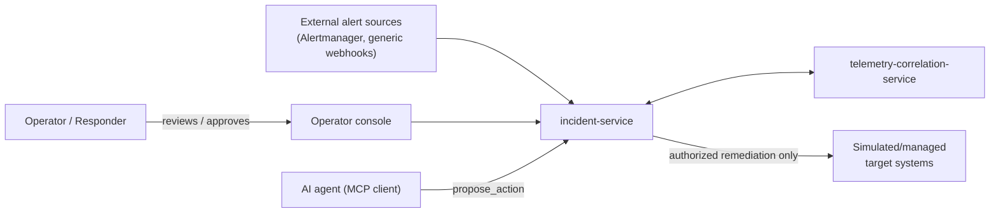

# SentinelOps System Overview

This document describes the architecture as actually implemented and tested. See
`docs/architecture/diagrams.md` for the full Mermaid diagram set (system context,
alert-to-incident sequence, AI-triage/RAG flow, MCP proposal/approval flow, remediation state
machine, observability pipeline, deployment topology) and `docs/architecture/data-model.md` for
the entity relationships.

## 1. System context

SentinelOps ingests alerts and telemetry from external sources, deduplicates and correlates them
into incidents, offers AI-assisted triage, exposes a policy-gated Model Context Protocol (MCP)
interface for AI agents, and executes approved remediation runbooks with automatic rollback.

```mermaid
flowchart LR
    Ext["External alert sources<br/>(Alertmanager, generic webhooks)"] --> IS[incident-service]
    Op["Operator / Responder"] -- reviews / approves --> Console[Operator console]
    Console --> IS
    Agent["AI agent (MCP client)"] -- propose_action --> IS
    IS <--> TS[telemetry-correlation-service]
    IS -- authorized remediation only --> Sim["Simulated/managed<br/>target systems"]
```

## 2. Component responsibilities

| Component | Responsibility |
| --- | --- |
| `incident-service` (Java/Spring Boot) | Owns the incident aggregate and lifecycle, alert ingestion/deduplication/routing/notification, AI-assisted triage, the MCP server, agent proposals, and the policy-controlled remediation engine. Publishes events through a transactional outbox. |
| `telemetry-correlation-service` (Java/Spring Boot) | Consumes deployment-change and service-dependency-change events, correlates them against open incidents, and publishes correlation results back through its own transactional outbox. |
| Operator console (React) | Human interface: incident queue/detail, agent proposals, remediation queue, platform health (SLO/error-budget status). Authenticates and authorizes every request identically to any other API client — never a privileged internal path. |
| MCP server (embedded in incident-service) | Exposes read-only tools/resources/prompts and a propose-then-approve path for incident actions to any MCP-speaking AI agent. Never executes a mutation directly. |
| Remediation engine (embedded in incident-service) | Versioned YAML runbooks, a deny-by-default policy engine, a strict execution state machine, and automatic rollback on a failed post-execution health check. |
| PostgreSQL (+ pgvector) | System of record for incidents, alerts, audit events, agent proposals, remediation runbooks/executions, and the AI-triage retrieval index. |
| Redpanda (Kafka-API-compatible) | Event backbone between `incident-service` and `telemetry-correlation-service`, and the transactional outbox's publish target. |
| Keycloak | OIDC identity provider; role-based access control (VIEWER/RESPONDER/ADMIN) enforced per endpoint. |
| Redis, MinIO | Provisioned in every environment; not yet read or written by any application code path (see `docs/development/local-platform.md`). |

## 3. Primary incident lifecycle

```mermaid
sequenceDiagram
    participant Src as Alert source
    participant IS as incident-service
    participant Corr as Correlation
    participant AI as AI-triage
    participant Human as Operator
    participant Rem as Remediation engine

    Src->>IS: Webhook (Alertmanager / HMAC-signed generic)
    IS->>IS: Validate, fingerprint, deduplicate
    IS->>Corr: Correlate with open incidents
    Corr-->>IS: Matched or new incident
    IS->>AI: Request triage suggestion (optional, on demand)
    AI-->>IS: Cited suggestion or graceful fallback
    Human->>IS: Review in console; propose a remediation runbook
    IS->>IS: Policy engine evaluates (ALLOW / DENY / REQUIRE_APPROVAL)
    Human->>Rem: Approve (if required)
    Rem->>Rem: Execute steps; verify health; roll back automatically on failure
```

See `docs/architecture/diagrams.md` for this same flow broken into its ingestion, AI-triage, and
remediation-specific sequence diagrams.

## 4. Data flow

1. An external source posts an alert to `incident-service` (`docs/development/alert-ingestion.md`).
2. The alert is validated, fingerprinted, and deduplicated (a delivery-level unique constraint
   plus fingerprint-locked semantic deduplication), then correlated against open incidents.
3. `telemetry-correlation-service` independently consumes deployment/dependency-change events and
   attaches correlation evidence to the same incident.
4. An operator or automated policy may request AI-assisted triage
   (`docs/development/ai-triage.md`) — retrieval-augmented, citation-honest, and never
   load-bearing for incident creation/correlation if unavailable.
5. An operator or an MCP-connected AI agent proposes an action; every mutation requires a
   separate, server-verified human approval (`docs/development/mcp-server.md`,
   `docs/development/remediation.md`).
6. An approved remediation runbook executes under policy-engine constraints (blast radius, risk
   classification, maintenance windows) with automatic rollback on a failed health check.
7. Every step is recorded in an immutable audit trail and exported as Prometheus
   metrics/OpenTelemetry traces/structured logs.

## 5. Trust boundaries

- **External alert sources ↔ incident-service**: authenticated via a static shared token
  (Alertmanager) or HMAC signature with replay protection (generic webhook) — never trusted by
  network origin alone.
- **AI agent (MCP) ↔ incident-service**: authenticated via the same OIDC bearer tokens as the
  REST API; scopes are derived from roles and can only be narrowed, never widened, by a token's
  own claims. Every mutation still requires separate human approval.
- **AI model output ↔ the rest of the system**: always treated as untrusted data, never as an
  instruction — see `docs/architecture/threat-model.md`.
- **Operator console ↔ backend services**: the console is an untrusted client authenticating
  through the same identity boundary as any other API client.

## 6. Human-approval boundary

No mutation triggered by an AI agent (via MCP) or a remediation-runbook proposal ever executes
without a separate, server-verified human approval: self-approval is rejected, approval replay is
prevented by an atomic consumption guard, and proposal content is re-verified against tampering
between approval and execution. See `docs/development/remediation.md` and
`docs/development/mcp-server.md` for the exact mechanisms.

## 7. Failure-handling principles

- **AI unavailability never blocks deterministic incident handling** — verified by
  `ChaosInjectingAiProviderTest` and the `llm-fault` chaos experiment.
- **A failed post-execution health check triggers automatic rollback** — verified by
  `RemediationExecutionSchedulerTest`.
- **Every chaos experiment restores the environment unconditionally** via a registered recovery
  trap, even on failure or interruption — see `docs/validation/chaos-engineering.md`.
- **Telemetry loss is visible, not silent**: consumer lag, outbox backlog, and dead-letter counts
  are exported as metrics, not hidden.

## 8. Deployment mapping

| Concern | Local (Docker Compose) | AWS (Terraform, see `infrastructure/terraform/`) |
| --- | --- | --- |
| Container orchestration | Docker Compose | EKS (`infrastructure/helm/sentinelops/`) |
| Object storage | MinIO | S3 |
| Relational + vector store | PostgreSQL + pgvector | RDS for PostgreSQL |
| Cache | Redis | ElastiCache for Redis |
| Event streaming | Redpanda | MSK (Kafka-compatible) |
| Identity | Keycloak | Keycloak on EKS |
| Observability | Prometheus/Grafana/Loki/Tempo | same stack on EKS, or managed equivalents |
| Delivery | `docker compose` / `helm install` | Argo CD (GitOps) against EKS |
