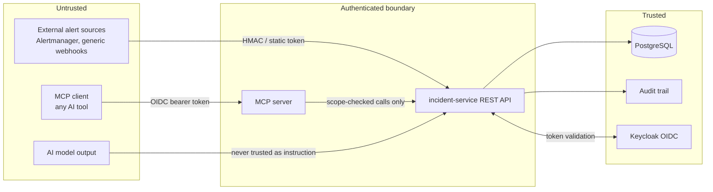

# System-wide threat model

Component-specific threat models already exist and are the authoritative detail for their area:
`docs/development/remediation.md`'s threat model (remediation engine), `docs/development/
mcp-server.md`'s trust model (MCP), and `docs/validation/security-validation.md` (CI security
tooling and accepted risks). This document is the system-wide view tying them together —
STRIDE-organized, covering the platform as a whole.

## Trust boundaries

## STRIDE summary

| Threat | Where it applies | Mitigation |
| --- | --- | --- |
| **Spoofing** | Alert webhook senders; MCP clients; console users | HMAC-signed generic webhooks with replay-window + constant-time comparison; static bearer token for Alertmanager; OIDC bearer tokens (Keycloak) for everything else — see `docs/development/security.md` |
| **Tampering** | Remediation proposal parameters altered between approval and execution | Content-hash re-verification at execution time (`ProposalContentHash`); every adapter re-validates parameters identically in `plan()` and `execute()` — see `docs/development/remediation.md` |
| **Repudiation** | An actor denying they approved/executed an action | Immutable, append-only audit trail (`AuditRecorder`) recording actor, action, correlation ID, and sanitized metadata for every mutation, including every remediation state transition |
| **Information disclosure** | Sensitive data in logs, error responses, or AI prompts | `RedactionService` strips actor/assignee IDs before AI-provider calls; `GlobalExceptionHandler`'s catch-all never returns a stack trace; audit metadata is explicitly sanitized before being recorded |
| **Denial of service** | Alert flood, AI-triage flood, remediation-proposal flood | Per-actor rate limits (AI cooldown, MCP rate limiter, proposal rate limiter); circuit breakers (AI provider, per-adapter-type in the remediation engine); bounded blast-radius policy denying overly broad remediation requests |
| **Elevation of privilege** | A VIEWER attempting a RESPONDER/ADMIN action; a self-approval; an MCP tool call exceeding its actor's role-derived scope | RBAC enforced at every controller (`RolePermissionMatrixTest`); self-approval rejected server-side for both agent proposals and remediation executions; MCP scopes derived from roles and only ever narrowed, never widened, by a token's own scope claim |

## Prompt-injection and confused-deputy (AI/MCP-specific)

Retrieved runbook content and incident free-text fields are always treated as untrusted data,
never as instructions — the MCP prompt catalog's shared `COMMON_GUARDRAILS` text makes this
explicit to the model, and no MCP tool call can execute a state change directly (every mutation
goes through the two-stage propose→approve flow). See `docs/development/mcp-server.md`'s trust
model section for the full detail, and `docs/validation/security-validation.md` for the
adversarial test coverage (`AiEvaluationTest`'s prompt-injection-resistance cases).

## What this phase changed

This document is new (Phase 16) — it consolidates existing, unchanged threat-modeling work from
Phases 7–15 into one system-wide view rather than introducing new mitigations. Where a
mitigation is described above, it already existed before this phase; this document's
contribution is making the full picture visible in one place.
